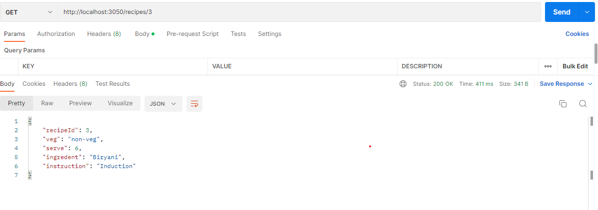
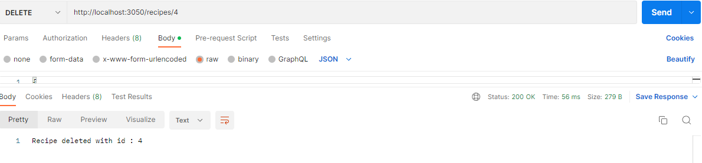
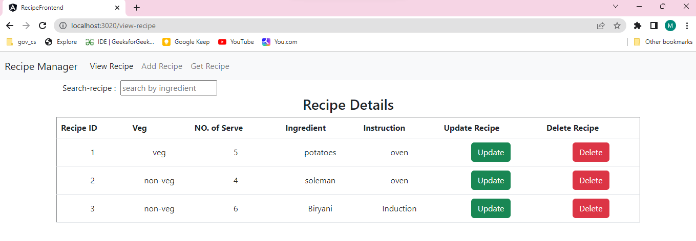
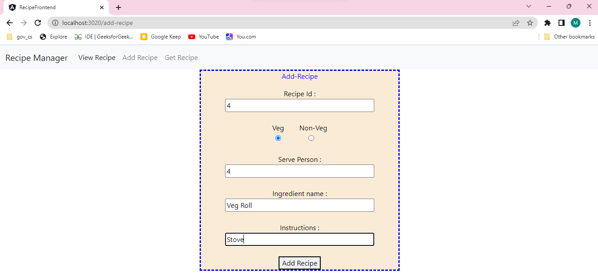
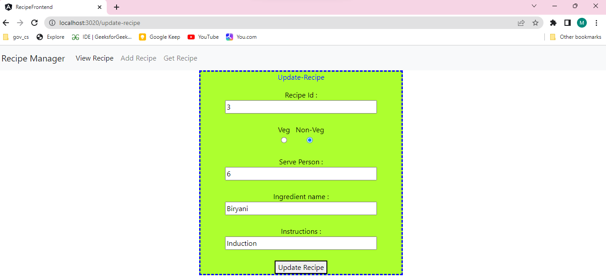
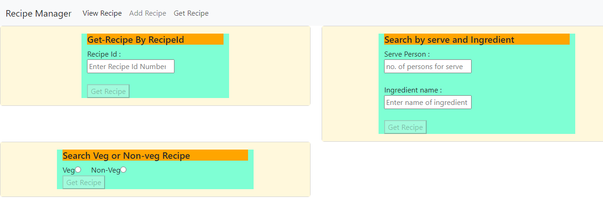
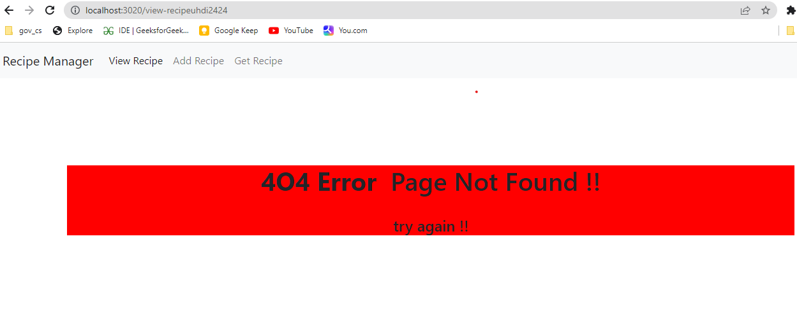

# Recipe_manager_full
Both Client And Server Side Application

This app features a web page using Angular where we can create and list recipes with CRUD operations. 
The app has a server in Spring Boot using MySql database which provides APIs with get, post, put and delete HTTP methods that the client consumes.

## This Project is based on:
* Maven
* Spring Boot
* Spring Data JPA( Mysql Database)
* Angular
* BootStrap

### DataBase Name : **recipe**

## WorkFlow of Spring Boot application:
``` controller -> service -> repository -> entity ```

## All Necessary dependency have been added to "Pom.xml"

* spring web
* Spring DevTool
* Spring Data JPA
* Mysql Driver

## In controller
``` we have made some API, which perform some CURD operations: ```

* Fetch all Recipe: http://localhost:3050/recipes

* Fetch Recipe by RecipeId: http://localhost:3050/recipes/1



* Get all Veg Recipe : http://localhost:3050/recipes/veg?veg=veg

* get Recipe by No. of serve and Ingredient: http://localhost:3050/recipes/?serve=5&ingredient=soleman

* get Recipe by Instruction not Ingredient : http://localhost:3050/recipes/soleman/induction

* Add new Recipe :  http://localhost:3050/recipes


* Update Recipe : http://localhost:3050/recipes/3


* Delete Recipe : http://localhost:3050/recipes/4



## For Testing :
I have added the Unit Testing For Repository and Service. Integration Testing For Controller.

## In this project we Use Angular as client side application

Here we use spring REST API to fetch all the data from backend and send it to client. For every CURD operations we have make different angular components. There is a service file in which all API has been called and integrate with Front-End. Here we also, add a Routing file in which all the route path has been called. Here is one more component for PageNOTFound if client hit wrong Url.

### Angular application run on port : 3020
``` ng s --port 3020 ```
* for view all Recipe : http://localhost:3020/view-recipe



* for Add any recipe : http://localhost:3020/add-recipe



* for Update-any Recipe: http://localhost:3020/update-recipe



* for Search any Recipe by RecipeId or serve&Ingredient or vegORNon-veg: http://localhost:3020/get-recipe

 

* For Client enter wrong Url : http://localhost:3020/abc

